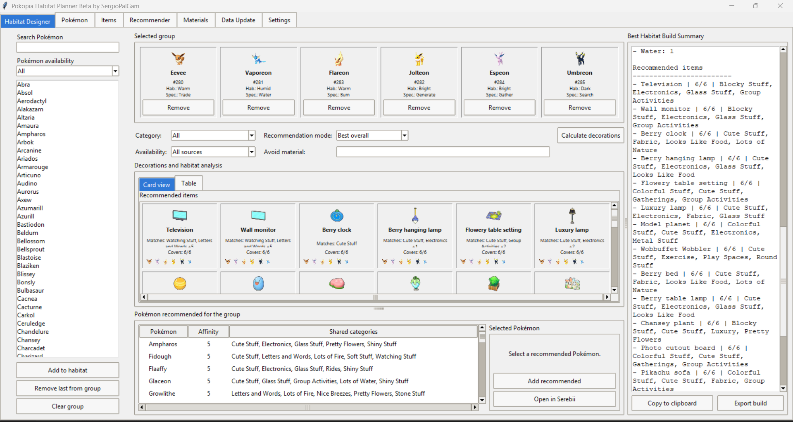
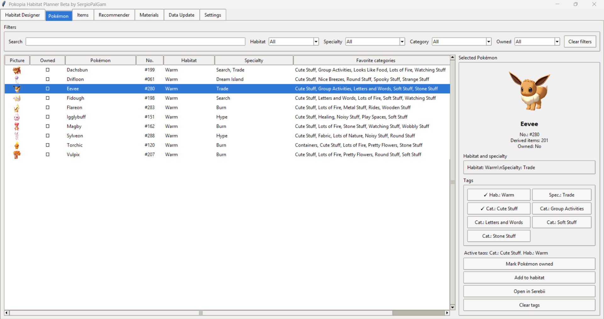
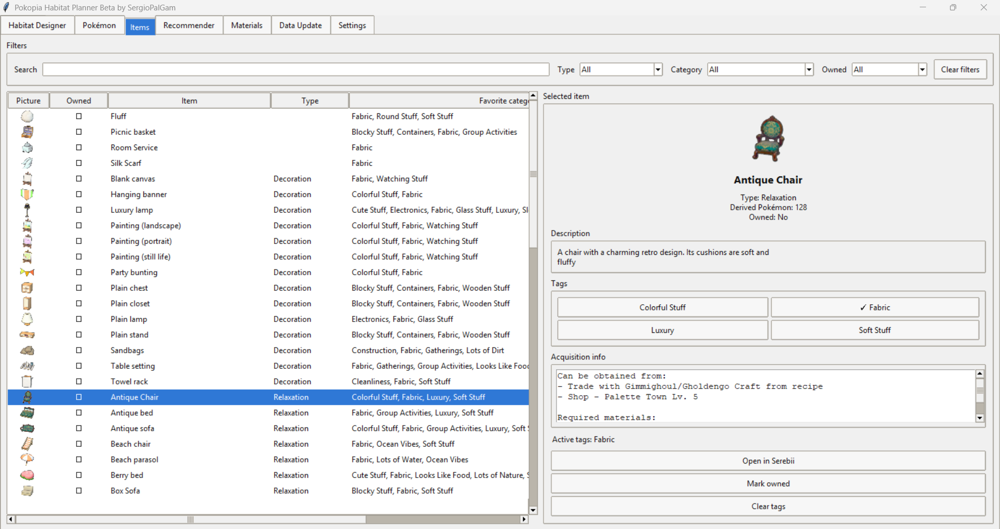
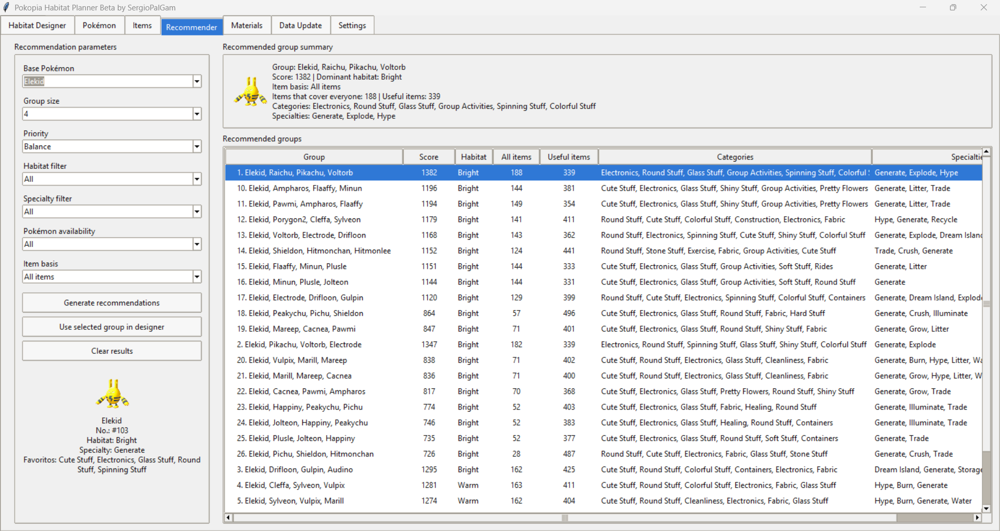
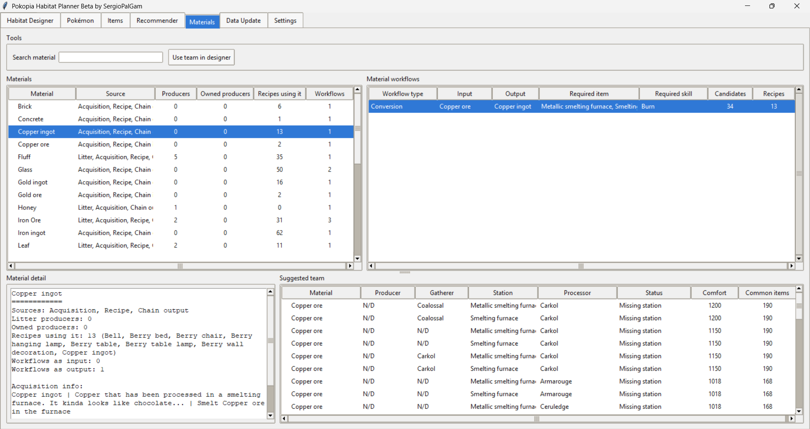

# Pokopia Habitat Planner Beta
Created by SergioPalGam.

Pokopia Habitat Planner is an unofficial fan-made planning tool for Pokémon Pokopia.

It helps players:
- organize Pokémon habitats
- compare comfort preferences
- review item compatibility
- track owned Pokémon and items
- plan material workflows

## Download
Go to the latest Release and download:
`Pokopia-Habitat-Planner-Beta-v0.1.0.zip`

Unzip the folder and run:
`Pokopia Habitat Planner.exe`

## Beta notice
This is a beta version. Data is based on publicly available Serebii information and may be updated as the game information changes.

Optional tips are appreciated if this tool saves you time:
Ko-fi: https://ko-fi.com/sergiopalgam

## Screenshots

### Habitat Designer

The Habitat Designer is the main planning screen. Here you can select up to six Pokémon and compare how well they fit together in the same habitat.

This tab helps you:

- build a habitat group
- check shared favorite categories
- find items that cover multiple Pokémon at once
- see recommended Pokémon that match the current group
- review the best habitat build summary
- export or copy a build for sharing

Use this tab when you already have a group in mind, or when you want to test whether a set of Pokémon can live together comfortably.

### Pokémon

The Pokémon tab is a searchable database of Pokémon available in the planner.

This tab lets you:

- browse Pokémon with their picture, number, habitat, specialty, and favorite categories
- filter by habitat, specialty, favorite category, and owned status
- mark Pokémon as owned or not owned
- use tags to quickly find similar Pokémon
- add a selected Pokémon directly to the Habitat Designer
- open the Pokémon’s Serebii page for reference

Use this tab when you want to inspect a specific Pokémon or find Pokémon with similar traits.

### Items

The Items tab is a searchable database of furniture, decorations, toys, materials, and other useful objects.

This tab lets you:

- browse items with their picture, type, favorite categories, and derived Pokémon count
- filter by item type, category, and owned status
- mark items as owned or not owned
- view item descriptions and acquisition information
- check detected required materials
- use category tags to filter items with similar comfort value
- open the item’s Serebii page for reference

Use this tab when you want to know what an item does, who it helps, where it comes from, or whether it fits your current planning needs.

### Recommender

The Recommender tab helps generate possible Pokémon groups based on a base Pokémon and planning preferences.

This tab lets you:

- choose a base Pokémon
- select a target group size
- prioritize different recommendation styles
- filter by habitat, specialty, Pokémon ownership, and item availability
- generate compatible Pokémon group suggestions
- send a recommended group directly to the Habitat Designer

Use this tab when you do not know which Pokémon to group together yet and want the app to suggest possible teams.

### Materials

The Materials tab helps review material sources, recipes, and workflows.

This tab shows:

- which materials are produced by Pokémon
- which materials are used in recipes
- which materials are supply materials
- which materials can be converted into other materials
- required items or stations for conversion workflows
- required Pokémon specialties for workflows
- suggested Pokémon teams for material production

This tab separates supply workflows from conversion workflows. For example, some materials are simply produced by Pokémon, while others require a specific item, station, or Pokémon specialty to become another material.

Use this tab when you want to plan material farming, understand recipe dependencies, or check what Pokémon and items are needed for a production workflow.

### Data Update
The Data Update tab is used to refresh the planner’s data.

The main button updates the data needed by the app, including Pokémon, items, favorite categories, acquisition information, material sources, and material workflows.

Use this tab when:

- you are opening the app for the first time, and didn´t unzipped the cache images folder.
- you want to refresh the planner with the latest available data
- something looks outdated or incomplete

For the beta version, most users should only need the main update option.

### Settings
The Settings tab currently works as an About and disclaimer page for the beta.

It explains:

- who created the tool
- what the tool is for
- that this is an unofficial fan-made planner
- that the app is not affiliated with Nintendo, The Pokémon Company, Game Freak, Creatures Inc., Serebii, or any official Pokémon-related entity

More settings may be added in later versions.

###To do list and Improvements
1. Fix mouse wheel across scrollable decoration/object areas
2. Dark Mode
3. Add hotkeys

## Disclaimer
Pokopia Habitat Planner is not affiliated with Nintendo, The Pokémon Company, Game Freak, Creatures Inc., Serebii, or any official Pokémon-related entity.
Pokémon, Pokémon Pokopia, character names, item names, and related assets are trademarks or copyrighted material of their respective owners.

This tool is provided for personal, non-commercial planning and educational use. Redistribution, resale, or repackaging without permission is not allowed.
